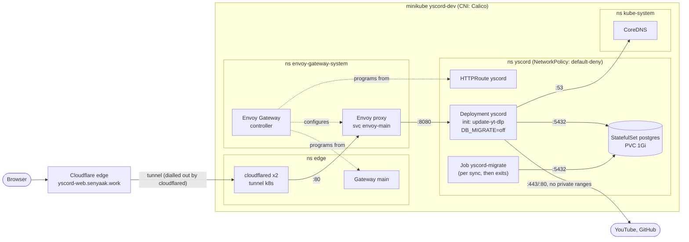
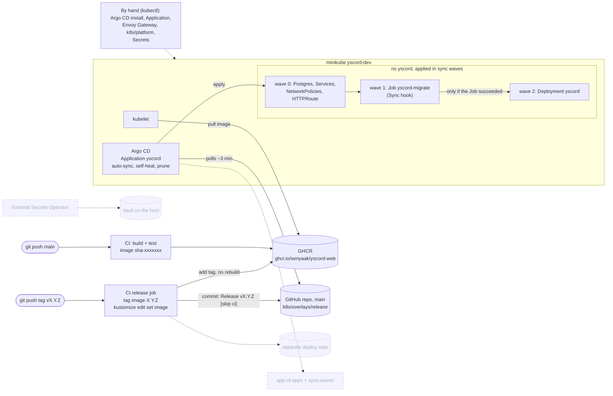

# Architecture

Living diagrams of what runs where and how a change reaches the cluster.
Updated as each stage lands. Dashed boxes are planned, not built yet.

## Runtime: how a request reaches the app

## Delivery: how a change reaches the cluster

